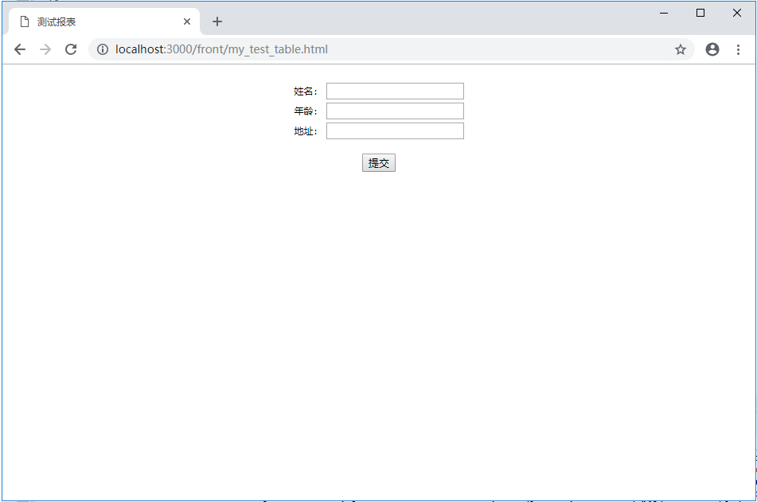
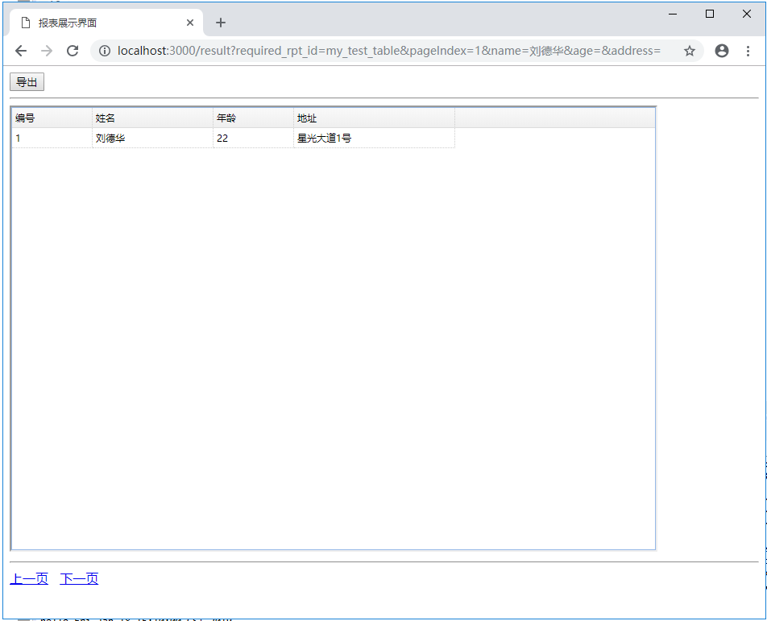

# walle-eva使用说明

## 简介
walle-eva是一个简单的数据展示系统，提供映射到数据库SQL的报表的展示和下载功能。
其中：  
- walle部分使用node.js的Express框架进行开发；
- eva部分使用Java的Spring Boot框架进行开发。

## 运行示例
### 产生一些数据
首先，在我们的示例中，使用的是MySQL 5.7数据库。  
在这里我使用 [./docs/test.sql](./docs/test.sql) 创建一个名为`testdb`的database，和一个名为`my_test_table`的表，并往表内插入一些数据。  

### 安装一些依赖的软件包
如果是第一次使用，我们需要进行一些预安装：  
- 进入walle目录，运行
```
npm install
```
以安装一些依赖。
- 使用Eclipse等Java开发的IDE打开eva项目，然后运行`maven install`以下载相关依赖。

### 运行程序
当walle和eva的相关依赖都下载安装完成后。
- 进入walle目录，运行：  
```
node app.js
```
以运行walle。
- 在Eclipse中首先执行一下`maven install`（为了将`src/main/resources`下的静态文件打包到target）然后运行EvaApplication.java或者打包eva成jar包并运行jar包。

可以登录`http://localhost:3000/front/my_test_table.html`查看效果，并且进行查询及下载。效果如下：  
  
  

